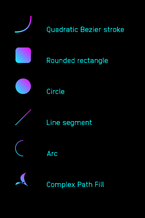
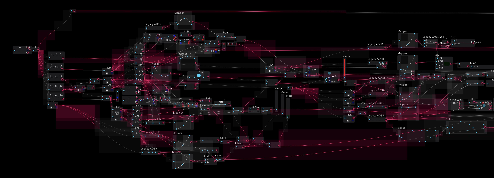

# vger

vger is a vector graphics renderer which renders a limited set of primitives, but does so almost entirely on the GPU. Works on iOS and macOS.

Each primitive can be filled with a solid color, gradient, or texture.

Here's an early screenshot from vger in use for Audulus:

## Why?

I was previously using nanovg for Audulus, but it was consuming too much CPU for an immediate mode UI. I'd guess that for most workloads, nanovg would be faster and more capable, but for Audulus, vger maintains 60fps while nanovg falls to 30fps on my iPad because of CPU-side path tessellation, and other overhead (vger renders analytically without tessellation, leaning heavily on the fragment shader).

vger isn't cross-platform (just iOS and macOS), but the API is simple enough that it could be ported fairly easily. If Audulus goes cross-platform again, I will port vger to vulkan or wgpu.

## Status

- Quadratic bezier strokes ✅
- Round Rectangles ✅ (need strokes)
- Circles ✅
- Line segments ✅ (need square ends for Audulus)
- Arcs ✅ (need square ends for Audulus)
- Text ✅ (Audulus only uses one font, but could add support for more if anyone is interested)
- Path Fills: need to fix some artifacts. Haven't done AA yet.

## Installation

To add vger to your Xcode project, select File -> Swift Packages -> Add Package Depedancy. Enter https://github.com/audulus/vger for the URL. Check the use branch option and enter `main`.

## Usage

Create a rendering context using `vgerNew()`.

Then call `vgerRenderPrim` and `vgerRenderText` to store drawing commands. vger doesn't support arbitrary path fills and strokes, instead focusing on primitives that can be easily rendered on the GPU.

See [`vger.h`](https://github.com/audulus/vger/blob/main/Sources/vger/include/vger.h) for the complete API.

Finally, call `vgerEncode` to encode rendering commands to a `MTLCommandBuffer`.

Vger has a C interface and can be used from C, C++, ObjC, or Swift. `vgerEncode` must be called from either ObjC or Swift since it takes a `MTLCommandBuffer`.

See [the demo app](https://github.com/audulus/vger/tree/main/Demo) for an example of using vger in a iOS/macOS SwiftUI app.
